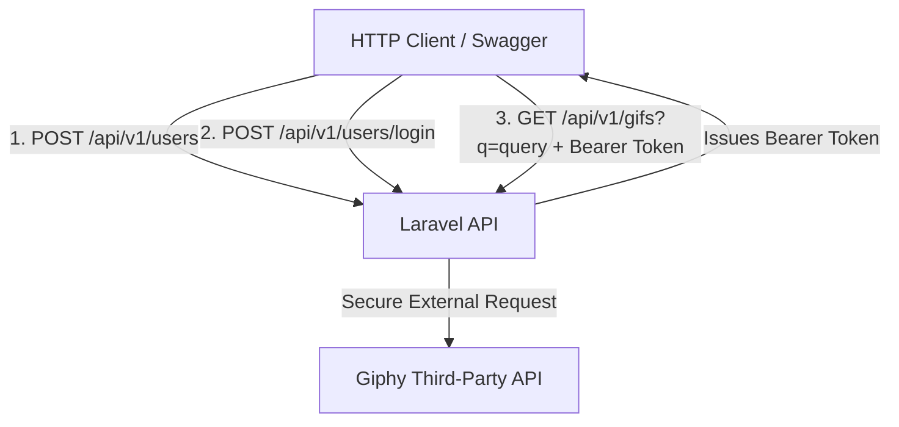

# Giphy API Integration Service

A production-ready RESTful API built with **Laravel 10** that integrates with the external **Giphy API**. The system features user authentication, secure endpoint protection using **Laravel Passport (OAuth2)**, and automated containerization via **Laravel Sail / Docker**.

---

## 🏗️ System Architecture & Authentication Flow



The service architecture strictly adheres to SOLID principles and clean RESTful Resource Routing:

Separation of Concerns: Business logic is decoupled, keeping the user domain (UserController) completely isolated from third-party API processing (GifController).

Dependency Injection: The HTTP Client (GuzzleHttp\Client) is managed natively by Laravel’s Service Container, enabling loose coupling and robust isolated automated testing.

### 🛠️ Features & Tech Stack
Core Framework: Laravel 10

Authentication: Laravel Passport (Bearer Tokens / OAuth2)

Database: MySQL

Environment & Containerization: Docker / Laravel Sail

Documentation: Swagger (OpenAPI 3.0)

External Integration: Giphy API (Search and Fetch by ID via decoupled service architecture)

### 🚀 Getting Started & Local Setup
Prerequisites
Ensure you have Docker Desktop installed and running on your system.

1. Environment Configuration
Clone the repository, navigate to the root directory, and copy the environment template:

```
Bash

cp .env.example .env

```

Open the .env file and verify or update your Giphy API credentials and pagination defaults:

```
Ini, TOML

GIPHY_API_KEY=SnfUK2t9gZTA2leY6JkZ0Ma9FxCwIoRA
GIPHY_API_URL_SEARCH=[https://api.giphy.com/v1/gifs/search](https://api.giphy.com/v1/gifs/search)
GIPHY_API_URL_BYID=[https://api.giphy.com/v1/gifs/](https://api.giphy.com/v1/gifs/)
GIPHY_DEFAULT_LIMIT=25
GIPHY_DEFAULT_OFFSET=0

```

2. Launch the Application with Docker (Laravel Sail)
Bring up the multi-container development environment in detached mode:

```
Bash

./vendor/bin/sail up -d

```

3. Run Database Migrations & Install OAuth Keys
Access the running container infrastructure to build the database schema and generate the cryptographic keys required for issuing secure OAuth2 tokens:

```
Bash

./vendor/bin/sail artisan migrate
./vendor/bin/sail artisan passport:install

```

The application will now be fully operational locally at http://localhost:8000


### 📖 Interactive API Documentation (Swagger)
The service includes an interactive API specification interface powered by Swagger. You can authorize requests, execute live calls against the local database, and inspect Giphy payloads directly from your browser.

Accessing the UI:
Ensure your Sail containers are up and running.

Navigate to: http://localhost:8000/api/documentation

Regenerating Documentation:
If you modify annotations (@OA\Get, @OA\Post, etc.) inside controllers, recompile the static JSON schema file by running:

```
Bash

./vendor/bin/sail artisan l5-swagger:generate

```

### 🧪 Automated Testing Suite
This service implements automated testing using feature integration tests to assert data parsing correctness, error responses, and controller middleware flows.

Isolated Third-Party API Mocking
To guarantee tests remain blazing fast, predictable, and 100% independent of network drops or Giphy rate limits, Guzzle calls are intercepted using a MockHandler. The test suite triggers internal bindings into Laravel's Service Container to swap real HTTP clients for predefined mocked JSON payloads (200 OK and 400 Bad Request), preventing the tests from ever hitting external servers over internet.

Running the Tests:
* Execute the entire testing suite:

```
Bash

./vendor/bin/sail artisan test

```

* Filter and target the Giphy test suite specifically:

```
Bash

./vendor/bin/sail artisan test --filter=GifIntegrationTest

```

### 🔌 API Endpoints Reference

### 🔐 Authentication & User Management

| Method | Endpoint | Description |
| :--- | :--- | :--- |
| `POST` | `/api/v1/users` | Registers a new user directly within the local ecosystem. |
| `POST` | `/api/v1/users/login` | Validates credentials and returns a secure Bearer Access Token. |

🎬 Giphy Integration & Personalization (Protected Endpoints)
_All requests below require a valid Authorization: Bearer <token> header._

| Method | Endpoint | Description |
| :--- | :--- | :--- |
| `GET` | `/api/v1/gifs?q={term}&limit={int}&offset={int}` | Queries Giphy API for matching items with dynamic pagination overrides. |
| `GET` | `/api/v1/gifs/{id}` | Fetches a deep detailed object payload for a single GIF by its unique path identifier. |
| `POST` | `/api/v1/gifs/favorites` | Links and saves a verified Giphy ID into the authenticated user's favorites collection. |


