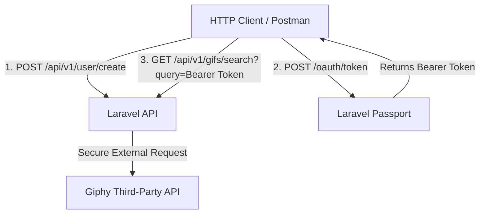

# Giphy API Integration Service

A production-ready RESTful API built with **Laravel 10** that integrates with the external **Giphy API**. The system features user authentication, secure endpoint protection using **Laravel Passport (OAuth2)**, and automated containerization via **Laravel Sail / Docker**.

---

## 🏗️ System Architecture & Authentication Flow



🛠️ Features & Tech Stack
Core Framework: Laravel 10

Authentication: Laravel Passport (Bearer Tokens / OAuth2)

Database: MySQL

Environment & Containerization: Docker / Laravel Sail

External Integration: Giphy API (Search and Fetch by ID)

🚀 Getting Started & Local Setup
Prerequisites
Ensure you have Docker Desktop installed and running on your system.

1. Environment Configuration
Clone the repository and move to the root directory. Create your local environmental file:

```
Bash

cp .env.example .env

```

Open the .env file and verify or update your Giphy API Credentials:

```

GIPHY_API_KEY=SnfUK2t9gZTA2leY6JkZ0Ma9FxCwIoRA
GIPHY_API_URL_SEARCH=[https://api.giphy.com/v1/gifs/search](https://api.giphy.com/v1/gifs/search)
GIPHY_API_URL_BYID=[https://api.giphy.com/v1/gifs/](https://api.giphy.com/v1/gifs/)

```

2. Launch the Application with Docker (Laravel Sail)
Bring up the multi-container environment in detached mode:

```
Bash

./vendor/bin/sail up -d

```

3. Run Database Migrations & Install OAuth Keys
Access the running container infrastructure to create the database schema and generate the secure cryptographic keys required for OAuth2 tokens:

```
Bash

./vendor/bin/sail artisan migrate
./vendor/bin/sail artisan passport:install

```

The application will now be fully operational locally at http://localhost:80.

🔌 API Endpoints Reference
🔐 Authentication & User Management
POST /api/v1/user/create Custom endpoint designed to register new testing users directly within the local ecosystem.

POST /oauth/token Standard Passport endpoint to authenticate credentials and request an Access Token (Expires in 30 minutes).

🎬 Giphy Integration (Protected Endpoints)
These endpoints require a valid Authorization: Bearer <token> header.

GET /api/v1/gifs/search?query={search_term} Queries the Giphy API for matching items using optimized default pagination limits and offsets.

GET /api/v1/gifs/{id} Retrieves deep detailed object payloads for a single GIF directly by its unique identifier.

🧪 Postman Collection
An export of the Postman integration testing environment can be found directly within the repository root (look for the .json collection file). Ensure you trigger the User Creation and Login workflows first to save the {{token}} global variable before querying protected endpoints.


